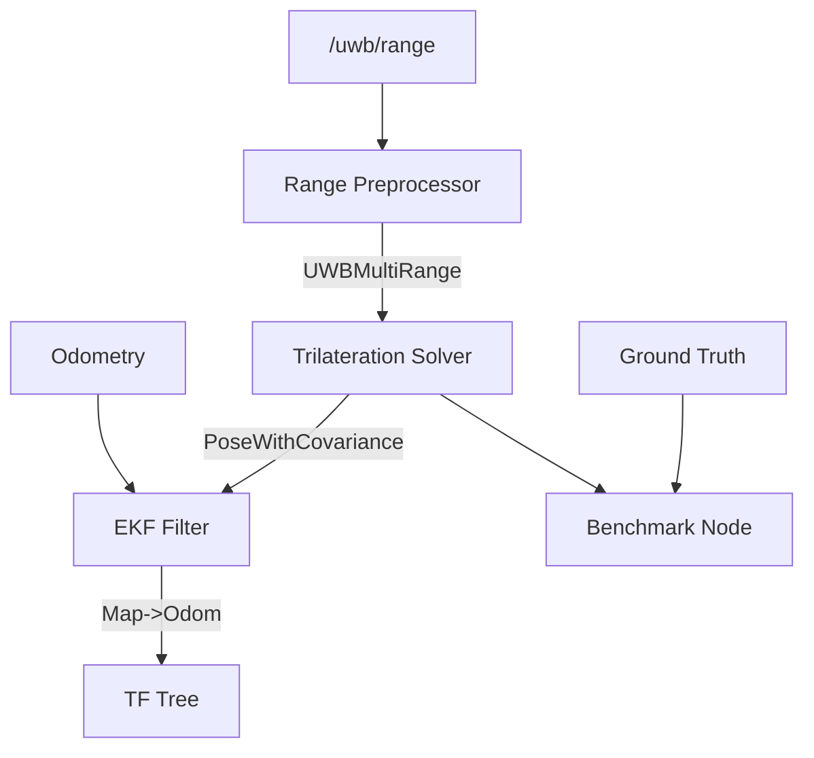

# ros2_uwb_localization

**Plug-and-play UWB indoor localization for ROS2.**

Drop-in package that takes UWB range measurements and outputs a filtered robot pose. Features a modular pipeline designed for production scale, supporting multiple sensor sources and extensible estimation algorithms.

[](https://docs.ros.org/en/humble/)
[](LICENSE)

---

## 🚀 Features

- **Modular Pipeline** — Decoupled aggregation, solving, and fusion.
- **UWBRange Interface** — Standardized messages for cross-hardware compatibility.
- **Range Preprocessor** — Aggregates asynchronous sensor data and filters outliers.
- **Iterative Solver** — Weighted Gauss-Newton engine with covariance propagation.
- **EKF Fusion** — Global drift correction (UWB + Odometry) via `robot_localization`.
- **Benchmark Suite** — Live RMSE/MAE tracking and CSV performance logging.

## 🏗️ Architecture



## 🚥 Quick Start

### Run Full Demo (Simulation)
```bash
ros2 launch ros2_uwb_localization demo.launch.py
```

### Run Localization Only (Real Hardware)
```bash
ros2 launch ros2_uwb_localization localization.launch.py use_sim_time:=false
```

## ⚙️ Configuration

### 1. Anchors (`config/anchors.yaml`)
Define your anchor coordinates (meters) in the global `map` frame.
```yaml
anchor_manager:
  ros__parameters:
    anchors:
      anchor_0: {id: "uwb_anchor_0", position: [5.0, 5.0, 2.0]}
      ...
```

### 2. Localization Params (`config/localizer.yaml`)
Tune the preprocessor and solver behavior.
```yaml
optimization_iterations: 15
outlier_threshold: 1.5
range_timeout: 0.5
```

## 📊 Benchmarking

The `uwb_benchmark_node` evaluates accuracy by comparing estimation topics to ground truth.

**Run Benchmark:**
```bash
ros2 run ros2_uwb_localization uwb_benchmark_node --ros-args -p log_file:=my_experiment.csv
```

**Metrics Calculated:**
- **RMSE**: Root Mean Square Error (Accuracy)
- **MAE**: Mean Absolute Error (Precision)
- **P95**: 95th Percentile Error (Robustness)

## 📡 Topics & Messages

| Topic | Message Type | Source |
|-------|--------------|--------|
| `/uwb/range` | `ros2_uwb_msgs/UWBRange` | Sensor Drivers / Sim |
| `/uwb/ranges_filtered` | `ros2_uwb_msgs/UWBMultiRange` | Preprocessor |
| `/uwb/pose` | `geometry_msgs/PoseWithCovarianceStamped` | Solver |
| `/odometry/filtered_uwb` | `nav_msgs/Odometry` | EKF |

## 📦 Package Nodes

- **`anchor_manager_node`**: Broadcasts static TFs for anchors.
- **`uwb_range_preprocessor`**: Aggregates ranges into synchronized batches.
- **`uwb_trilateration_solver`**: Resolves batches into global 3D positions.
- **`uwb_benchmark_node`**: Computes and logs error statistics.
- **`uwb_visualization_node`**: Publishes RViz markers for anchors and ranges.
